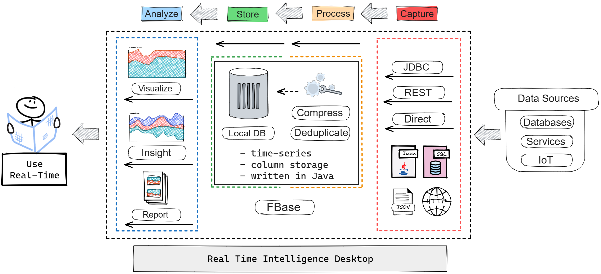

# Real-time-intelligence-desktop

## Table of contents

- [Architecture](#architecture)
- [Prerequisites](#prerequisites)
- [Build](#build)
- [Installation](#installation)
- [Development](#development)
- [Documentation](#documentation)
- [Integration](#integration)
- [License](#license)
- [Support and service](#support-and-service)

## Architecture

**Real Time Intelligence Desktop** is a desktop application designed to collect, store, visualize, and analyze real-time data.



Real Time Intelligence Desktop usage options:

1. System monitoring;
2. Different types of stress and load testing;
3. Advanced diagnostics of service or database problems;
4. Research activities.

[Return to Table of Contents](#table-of-contents)

## Prerequisites

**Real-time-intelligence-desktop** is compatible with Java 17 or later.

[Return to Table of Contents](#table-of-contents)

## Build

To compile the application into an executable jar file, do the following:

1. Install JDK version 17 or higher, Maven and Git on your local computer:
    ```shell
    java -version  
    mvn -version
    git --version 
    ``` 
2. Download the source codes of the application to your local computer using Git:

    ```shell
    git clone <url>
    cd real-time-intelligence-desktop
    ```

3. Compile the project using Maven:
    ```shell
    mvn clean compile
   ```

4. Execute the Maven command to build an executable jar file with tests running:
    ```shell
     mvn clean package
    ```

[Return to Table of Contents](#table-of-contents)

## Installation

- Windows Platform, run.bat
    ```shell
    SET JAVA_HOME=C:\PROGRAM FILES\JAVA\jdk-17  
    SET JAVA_EXE="%JAVA_HOME%\bin\java.exe"
    chcp 65001
  
    %JAVA_EXE% -Xmx1024m -DtestMode=false -Dfile.encoding=UTF8 -jar desktop-1.0-SNAPSHOT-jar-with-dependencies.jar
    ```
- Linux platform, run.sh
  ```shell
    #!/bin/bash
  
    export JAVA_HOME=/usr/lib/jvm/java-17-openjdk-amd64
    export JAVA_EXE=$JAVA_HOME/bin/java
    export LANG=en_US.UTF-8

    $JAVA_EXE -Xmx1024m -DtestMode=false -Dfile.encoding=UTF8 -jar desktop-1.0-SNAPSHOT-jar-with-dependencies.jar
  ```

To start working with the application you need to run the executable file **run.bat/run.sh**

[Return to Table of Contents](#table-of-contents)

## Development

If you found a bug in the code or have a suggestion for improvement, please create an issue on GitHub.

Before starting work, it is necessary to check the [Build](#build)

It is also necessary to check the successful completion of unit tests

  ```shell
    mvn clean test
  ```

[Return to Table of Contents](#table-of-contents)

## Documentation

| EN                                              | RU                                                            |
|:------------------------------------------------|:--------------------------------------------------------------|
| [User guide](docs/guides/user/user-guide-en.md) | [Руководство пользователя](docs/guides/user/user-guide-ru.md) |

[Return to Table of Contents](#table-of-contents)

## Integration

To use CI/CD use Gitea Actions:

1. Install gitea 1.20 using [Docker](https://docs.gitea.com/next/installation/install-with-docker);
2. Add additional configurations in app.ini to enable [Actions](https://blog.gitea.io/2022/12/feature-preview-gitea-actions/); 
3. Install gitea [runner](https://gitea.com/gitea/act_runner) follow this [guide](https://blog.gitea.io/2022/12/feature-preview-gitea-actions/);
4. Use [Docker compose file](docs/docker/docker-compose.yml);
5. Create pipeline in [build.yaml](.gitea/workflows/build.yaml).

[Return to Table of Contents](#table-of-contents)

## License

[](https://opensource.org/licenses/Apache-2.0)
Code released under the Apache License Version 2.0

[Return to Table of Contents](#table-of-contents)

## Support and Service

Created with support of ["Innovation Promotion Fund"](https://fasie.ru/) by competition ["Code-Digital Technologies"](https://fasie.ru/press/fund/kod-dt/) - ["Results"](https://fasie.ru/press/fund/kod-dt-results/) within the framework of the national program [“Digital Economy of the Russian Federation”](https://digital.gov.ru/ru/activity/directions/858/).

Contact technical support by email [@support](mailto:support@real-time-intelligence.ru)

Technical support website at ["Real time intelligence"](https://support.real-time-intelligence.ru)

[Return to Table of Contents](#table-of-contents)
