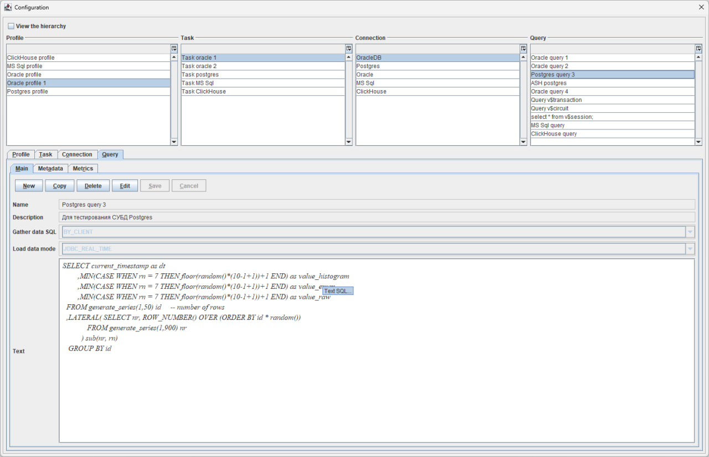

# Real Time Intelligence Desktop

## Contents

- [Introduction](#introduction)
- [Project assembly](#project-assembly)
- [Installation and setup](#installation-and-setup)
- [Configuration management](#configuration-management)
- [Data collection](#data-collection)
- [Data storage](#data-storage)
- [Data visualization](#data-visualization)
- [Data analysis](#data-analysis)
- [Reporting system](#reporting-system)
- [Screencast](#screencast)
- [Support and service](#support-and-service)

## Introduction

**Real Time Intelligence Desktop** is a desktop application designed to collect, store, visualize, and analyze real-time data.


Some key benefits of **Real Time Intelligence Desktop** include:

- Real-time data collection and analysis. Statistical data is collected in real time, allowing users to track metrics online, analyze reactions to different types of impact, view  history and comparative analysis. Local data storage and protection. Data is stored locally to ensure protection against risks of data inaccessibility. If there is a need to share monitoring data the software can easily be configured to use an external database for storage.
- Flexible and fast setup of data collection profiles. This feature is especially useful when speed is of the utmost importance and users need to quickly collect specific statistics for a more detailed evaluation of a system or component.
- Simple and intuitive interface. Real Time Intelligence Desktop has a user-friendly interface that makes it easy for users with the metrics even without knowledge of SQL.

Real Time Intelligence Desktop usage options:

1. System monitoring;
2. Different types of stress and load testing;
3. Advanced diagnostics of service or database problems;
4. Research activities.

[Return to Table of Contents](#contents)

## Project assembly

To compile the application into an executable jar file, do the following:

1. Install JDK version 17 or higher, Maven and Git on your local computer.
    ```shell
    java -version  
    mvn -version
    git --version 
    ``` 
2. Download the source codes of the application to your local computer using Git

    ```shell
    git clone <url source code storage systems>
    cd real-time-intelligence-desktop
    ```

3. Compile the project using Maven
    ```shell
    mvn clean compile
   ```

4. Execute the Maven command to build an executable jar file with tests running
    ```shell
     mvn clean package -DskipTests=false 
    ```

An executable jar file like `desktop-<VERSION>-SNAPSHOT-jar-with-dependencies.jar` will be located at the relative path desktop/target

[Return to Table of Contents](#contents)

## Installation and setup

1. Make sure you have JDK version 17 or higher installed on your computer. Detailed installation instructions for your platform at [oracle.com](https://www.oracle.com/java/technologies/downloads/)
2. Download the executable jar file of the application from GitHub.com or perform a local build using the instructions from [Project Build](#build-project)
3. Create a directory to store the configuration and local database of the application.
4. Copy the jar file to the directory where you create the executable run file:

- Windows Platform, run.bat
    ```shell
    SET JAVA_HOME=C:\PROGRAM FILES\JAVA\jdk-17  
    SET JAVA_EXE="%JAVA_HOME%\bin\java.exe"
    chcp 65001
    %JAVA_EXE% -Xmx1024m -DtestMode=false -Dfile.encoding=UTF8 -jar desktop-1.0-SNAPSHOT-jar-with-dependencies.jar
    ```
- Linux platform, run.sh
  ```shell
    SET JAVA_HOME=C:\PROGRAM FILES\JAVA\jdk-17
    SET JAVA_EXE="%JAVA_HOME%\bin\java.exe" 
    chcp 65001
    %JAVA_EXE% -Xmx1024m -DtestMode=false -Dfile.encoding=UTF8 -jar desktop-1.0-SNAPSHOT-jar-with-dependencies.jar
  ```

In the line **SET JAVA_HOME** you need to write path to the directory where JDK is installed on your local computer

To start working with the application you need to run the executable file **run.bat/run.sh**

[Return to Table of Contents](#contents)

## Configuration management

The configuration of **Real Time Intelligence Desktop** application consists of several main entities including **Profile**, **Task**, **Connection** and **Request**.

- A **Profile** is a repository of information about a particular profile, including its name, a brief description and list of tasks to be performed when you start this profile. <a href="media/config/profile.gif" target="_blank"> Screencast</a>


- **Task**, in turn, is an entity that contains a list of queries that must be executed within this task. Each task also contains the name of the request, a brief description, the connection and the frequency of queries to the remote system. <a href="media/config/task.gif" target="_blank">Screencast </a>


- **Connection** is an entity that contains all the necessary information about the details of the connection to the remote JDBC system. Connection attributes: name, URL, username, password, as well as file location information and class name JDBC Driver class. <a href="media/config/connection.gif"  target="_blank">Screencast</a>


- **Queries** are textual descriptions of SQL queries that are sent to the server to retrieve data.
  Each query also contains information about the name of the query, a short description, the way of filling the data (locally or on the server)  and data loading mode (direct, JDBC in real time, batch data loading from JDBC source).<a href="media/config/query.gif"  target="_blank">Screencast </a>



Methods of filling data:

- Locally, when we load data directly from a remote system into the local database;
- On server, when data are filled by separate process, and we only load them locally.

Inside the query interface there are also metadata entities for the local database table and metrics.

- **Metadata** contains information about the table configuration in the local FBase engine data repository according to
  the query data. Table metadata: name, storage type (regular table or table for storing time series data), indexing type
  (local or global), data compression, table column for time tracking, metadata of table columns.  The interface also displays the connection to the job data source in which the query is executed.
  This is needed in order to load metadata on the query into the local storage.


- **Metrics** is an entity for displaying specially prepared statistics.
  Attributes of metrics: name, X axis (column name), Y axis (column name), grouping of data (by column), function (way of processing of displayed data), way of graphical data displaying (linear, stacked graphs), default value (when displaying detail data for stacked plots). At the bottom there is a list of all the metrics for the given query are displayed at the bottom.


There are two modes available in the application interface: **View** and **Edit** data.

- In the **View** mode the data is displayed taking into account the hierarchical structure that is formed on the basis of the profiles.
  Each profile can contain several tasks, each of which can include several queries.  Each job is linked to a single connection, which allows you to perform multiple queries to the same data source. <a href="media/config/view.gif"  target="_blank">Screencast </a>


- In the **Edit** mode the user has the ability to create new objects, copy, delete and modify existing ones. <a href="media/config/edit.gif"  target="_blank">Screencast</a>


The application has functionality that allows you to create a profile using pre-created job templates, connections and requests, which are available in the interface **Settings** and **Templates**.

[Return to Table of Contents](#contents)

## Data collection

The application collects data from remote systems via the JDBC protocol or directly from the application. All data sources for which an appropriate JDBC driver is developed.

The logic for obtaining time series data depends on where the data is collected.

1. If the table data from the remote system is filled on the server, we choose the option **Collect data on the server**. The application tracks the pointer to the timestamp of the last selected record, then loads the data into the local database, that were added on the remote system.
2. The **Collect data on the client** option allows you to collect data from the remote system and store it locally, the timestamps are tracked by the application.

The timestamps are tracked by a column with the data type **Timestamp**, which is defined in the settings by table. In the configuration interface, this setting is located in **Queries** -> **Metadata** -> **Timestamp drop-down list**.

[Return to Table of Contents](#contents)

## Data storage

Data storage in the application is implemented with the use of a specialized storage system of block-column type with compression [FBase](https://github.com/real-time-intelligence/fbase).

DB settings are located in the **Queries** -> **Metadata** interface. The usual tables are supported and tables for storing time series data. Three types of column data storage are available: RAW, ENUM and HISTOGRAM. The types of column data storage types are determined in the settings at the table or block level (the **Global** or **Local** indexing setting). Local indexing on the block level is a function for automatically selecting the appropriate storage type for the block  based on data distribution. The storage type selection in this option is automatic. Data compression is supported. Settings for data compression and storage type selection are made dynamically.

[Return to Table of Contents](#contents)

## Data visualization

The application supports three data display options:

1. Real-time mode, when the data are visualized as they arrive. To display data in this mode, you need to select the appropriate metric or query column in the **Real-time** interface. In the **Details** interface, it is possible to choose **Count**, **Sum** and **Average** functions. For numeric values it is possible any of these functions can be selected, for string data it is not possible to call the sum and average calculation. The **As is** function is under development. <a href="media/view/real-time.gif"  target="_blank">Screencast </a>


2. In the historical section, when the data is displayed for the previous observation period. To do this you need to select a metric or query column and specify the range in **History** interface. The **Custom** field allows for more detailed range selection using the **Relative** and **Absolute** interfaces.

   <a href="media/view/history.gif"  target="_blank"> Screencast</a>


3. Ad-hoc queries, when the data is displayed for a particular keyword. To do this, you need to go to the Search interface, specify a substring to search for and click the Go button. <a href="media/view/search.gif"  target="_blank"> Screencast</a>


[Return to Table of Contents](#contents)

## Data analysis

Section in development.

[Return to Table of Contents](#contents)

## Reporting system

The application has a function for creating reports in PDF format.

### Customising report parameters

To customise the report parameters, you need to select the appropriate profile, job and query and then select the corresponding 
metric or query column in the **Report** interface. On the **Design** tab, there is an option to select a date range.
After displaying the design of the future report, you can edit the description, you can select the desired one from the **Count**, **Sum** and
**Average**. For numeric values any of these functions can be selected, for string data it is not possible to call **Count**, **Sum** and **Average** functions.
calculation of the average value.


### Report generation

After the user has configured all the necessary parameters of the report, he starts the process of generating the report using
the button **Report** <a href="media/report/report.gif"  target="_blank">Screencast</a>


### Viewing the report

The created PDF report is displayed on the **Report** tab, designed for viewing reports. The report contains all the data from the design: graphs, tables and comments.


### Exporting a report

The user is given the opportunity to export the report in PDF format. To do this, use the **Save** button to select the directory to save the report file.

## Screencast

|              | Screencast                                                                        |
|:-------------|:----------------------------------------------------------------------------------|
| Profile      | <a href="media/config/profile.gif"  target="_blank">Screencast profile </a>       |
| Task         | <a href="media/config/task.gif"  target="_blank">Screencast task </a>             |
| Connection   | <a href="media/config/connection.gif"  target="_blank">Screencast connection </a> |
| Query        | <a href="media/config/query.gif"  target="_blank">Screencast query </a>           |
| View         | <a href="media/config/view.gif"  target="_blank">Screencast view </a>             |
| Edit         | <a href="media/config/edit.gif"  target="_blank">Screencast edit </a>             |
| Real-time    | <a href="media/view/real-time.gif"  target="_blank">Screencast real-time </a>     |
| History      | <a href="media/view/history.gif"  target="_blank">Screencast history </a>         |
| Ad-hoc query | <a href="media/view/search.gif"  target="_blank">Screencast ad-hoc </a>           |
| Report       | <a href="media/report/report.gif"  target="_blank">Screencast report</a>          |   

[Return to Table of Contents](#contents)

## Support and Service

Created with support of ["Innovation Promotion Fund"](https://fasie.ru/) by competition ["Code-Digital Technologies"](https://fasie.ru/press/fund/kod-dt/) - ["Results"](https://fasie.ru/press/fund/kod-dt-results/) within the framework of the national program [“Digital Economy of the Russian Federation”](https://digital.gov.ru/ru/activity/directions/858/).

Contact technical support by email [@support](mailto:support@real-time-intelligence.ru)

Technical support website at ["Real time intelligence"](https://support.real-time-intelligence.ru)

[Return to Table of Contents](#contents)
