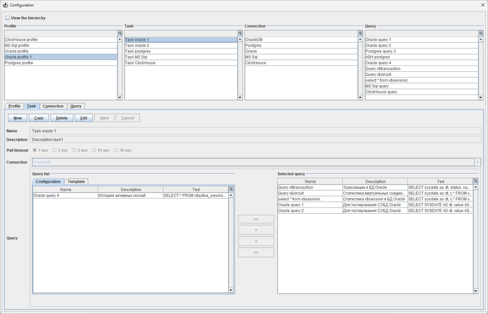
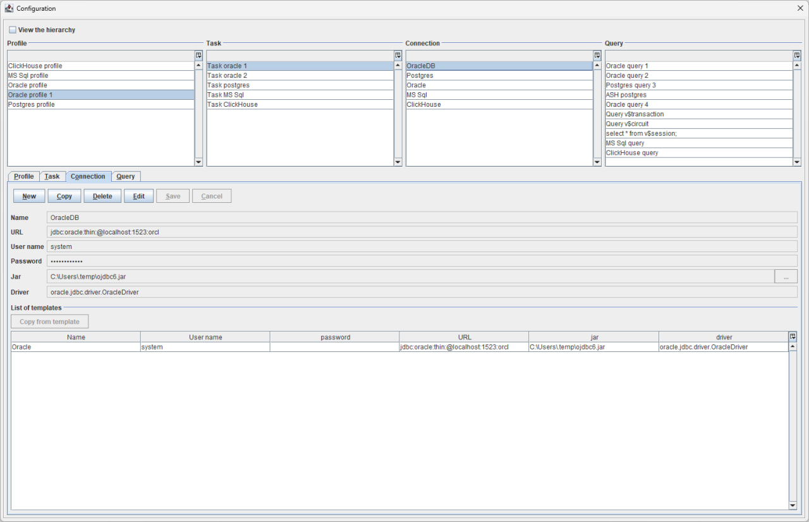
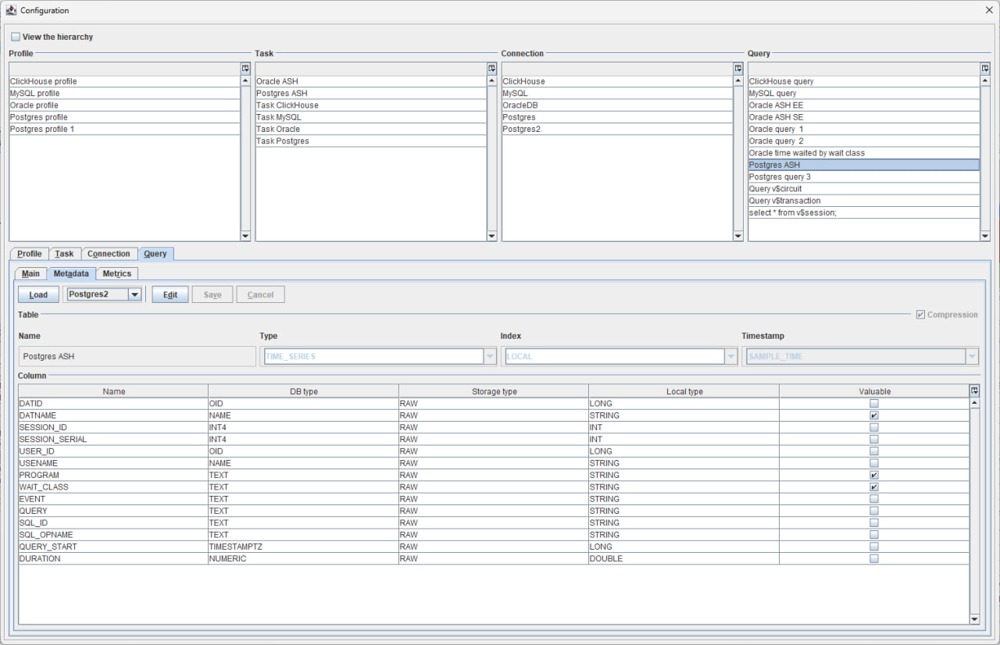
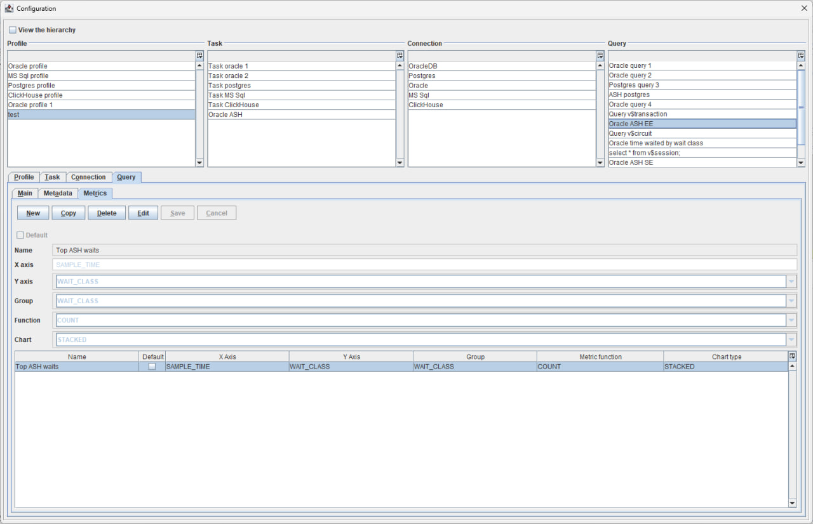
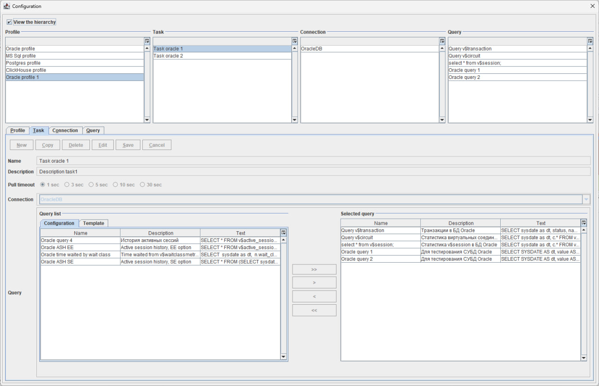
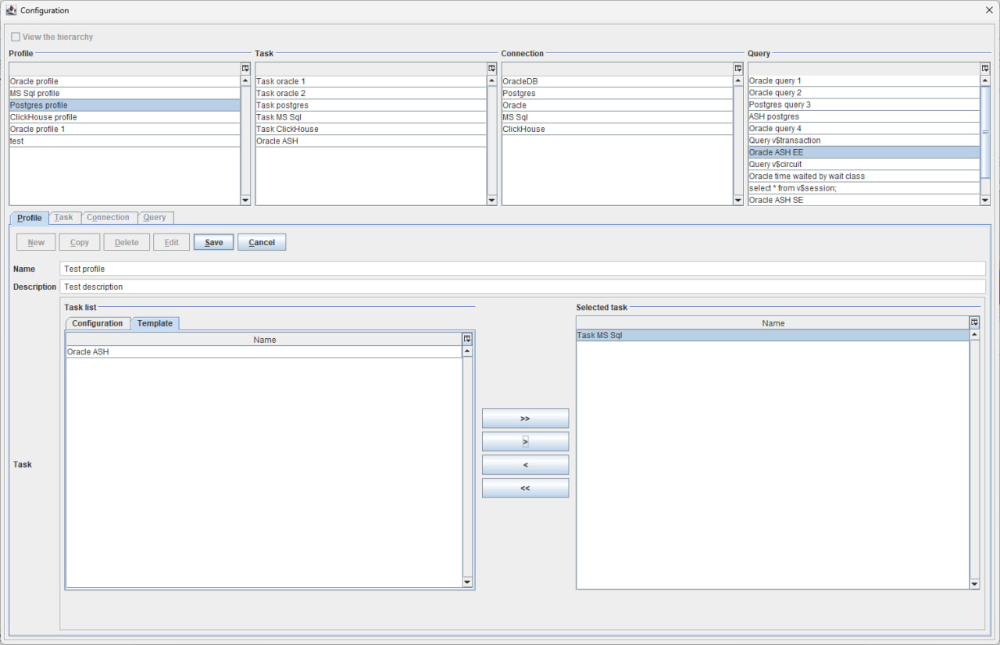

# Real Time Intelligence Desktop

## Содержание

- [Введение](#введение)
- [Сборка проекта](#сборка-проекта)
- [Установка и настройка](#установка-и-настройка)
- [Управление конфигурацией](#управление-конфигурацией)
- [Сбор данных](#сбор-данных)
- [Хранение данных](#хранение-данных)
- [Визуализация данных](#визуализация-данных)
- [Анализ данных](#анализ-данных)
- [Screencast](#screencast)
- [Поддержка и обслуживание](#поддержка-и-обслуживание)

## Введение

**Real Time Intelligence Desktop** - это настольное приложение, предназначенное для сбора, хранения, визуализации и анализа данных в режиме реального времени.


Некоторые из ключевых преимуществ **Real Time Intelligence Desktop** включают:

- Сбор и анализ данных в режиме реального времени. Статистические данные собираются в режиме реального времени, что позволяет
  пользователям отслеживать показатели в режиме онлайн, анализировать реакцию на различные виды воздействия, просматривать
  историю и проводить сравнительный анализ. Локальное хранение и защита данных. Данные хранятся локально, что обеспечивает
  защиту от рисков недоступности данных. Если есть необходимость организовать общий доступ к данным мониторинга, программное
  обеспечение можно легко настроить на использование внешней базы данных для хранения.

- Гибкая и быстрая настройка профилей сбора данных. Эта функция особенно полезна, когда скорость имеет первостепенное
  значение и пользователям необходимо быстро собрать специальные статистические данные для более детальной оценки характеристик
  системы или компонента.

- Простой и интуитивно понятный интерфейс. Real Time Intelligence Desktop имеет удобный интерфейс, который облегчает
  работу пользователей с метриками даже без знания SQL.

Варианты использования Real Time Intelligence Desktop:

1. Мониторинг систем;
2. Различные виды стресс и нагрузочного тестирования;
3. Расширенная диагностика проблем в работе сервисов или БД;
4. Исследовательская деятельность.

[Вернуться в оглавление](#содержание)

## Сборка проекта

Для компиляции приложения в исполняемый jar-файл необходимо выполнить следующее:

1. Установить на локальный компьютер JDK не ниже 17 версии, Maven и Git.
    ```shell
    java -version  
    mvn -version
    git --version 
    ``` 

2. Загрузить исходные коды приложения на локальный компьютер с помощью Git
    ```shell
    git clone <url системы хранения исходных кодов>
    cd real-time-intelligence-desktop
    ```

3. Выполнить компиляцию проекта с помощью Maven
   ```shell
    mvn clean compile
   ```

4. Выполнить команду Maven для сборки исполняемого jar-файла с запуском тестов
    ```shell
     mvn clean package -DskipTests=false 
    ```

Исполняемый jar-файл вида `desktop-<VERSION>-SNAPSHOT-jar-with-dependencies.jar` будет располагаться по относительному пути desktop/target

[Вернуться в оглавление](#содержание)

## Установка и настройка

1. Убедитесь, что на вашем компьютере установлена JDK версии 17 или выше. Подробная инструкция по установке для вашей платформы на сайте [oracle.com](https://www.oracle.com/java/technologies/downloads/)
2. Загрузите исполняемый jar-файл приложения с сайта github.com или выполните локальную сборку по инструкции из раздела [Сборка проекта](#сборка-проекта)
3. Создайте директорию для хранения конфигурации и локальной базы данных приложения.
4. Скопируйте jar-файл в директорию, в которой создайте исполняемый файл запуска:

- Платформа Windows, run.bat
    ```shell
    SET JAVA_HOME=C:\PROGRAM FILES\JAVA\jdk-17  
    SET JAVA_EXE="%JAVA_HOME%\bin\java.exe"
    chcp 65001
    %JAVA_EXE% -Xmx1024m -DtestMode=false -Dfile.encoding=UTF8 -jar desktop-1.0-SNAPSHOT-jar-with-dependencies.jar
    ```
- Платформа Linux, run.sh
  ```shell
    SET JAVA_HOME=C:\PROGRAM FILES\JAVA\jdk-17
    SET JAVA_EXE="%JAVA_HOME%\bin\java.exe" 
    chcp 65001
    %JAVA_EXE% -Xmx1024m -DtestMode=false -Dfile.encoding=UTF8 -jar desktop-1.0-SNAPSHOT-jar-with-dependencies.jar
  ```

  В строке **SET JAVA_HOME** необходимо прописать путь к директории где на вашем локальном компьютере установлен JDK

  Для начала работы с приложением нужно запустить исполняемый файл **run.bat/run.sh**

[Вернуться в оглавление](#содержание)

## Управление конфигурацией

Конфигурация приложения **Real Time Intelligence Desktop** состоит из нескольких основных сущностей, включая **Профиль**, **Задание**, **Подключение** и **Запрос**.

- **Профиль** представляет собой хранилище информации о конкретном профиле, включая его название, краткое описание и список заданий, которые должны быть выполнены при запуске данного профиля. <a href="media/config/profile.gif" target="_blank">Screencast  </a>


- **Задание**, в свою очередь, является сущностью, содержащей список запросов, которые должны быть выполнены в рамках данного задания. Каждое задание также содержит имя запроса, краткое описание, подключение и частота запросов к удаленной системе. <a href="media/config/task.gif" target="_blank">Screencast </a>



- **Подключение** - это сущность, содержащая всю необходимую информацию о деталях подключения к удаленной системе JDBC.
  Атрибуты подключения: имя, URL-адрес, имя пользователя, пароль, а также информацию о расположение файла и название класса JDBC Driver-а. <a href="media/config/connection.gif"  target="_blank">Screencast</a>



- **Запросы** представляют собой текстовые описания SQL-запросов, которые отправляются на сервер для получения данных.
  Каждый запрос также содержит информацию о названии запроса, краткое описание, способе наполнения данных (локально или на сервере) и режиме загрузки данных(прямой, JDBC в режиме реального времени, пакетная загрузка данных из JDBC источника).  <a href="media/config/query.gif"  target="_blank">Screencast </a>


Способы наполнения данных:

- локально, когда мы загружаем данные напрямую из удаленной системы в локальную БД;
- на сервере, когда данные заполняются отдельным процессом и мы только подгружаем их локально.

Внутри интерфейса запроса также присутствуют сущности метаданные по таблице локальной БД и метрики.

- **Метаданные** содержат информацию о конфигурации таблицы в локальном хранилище данных движка FBase по данным запроса.
  Метаданные таблицы: имя, тип хранения(обычная таблица или таблица для хранения данных временных рядов), тип индексирования
  (локальный или глобальный), сжатие данных, столбец таблицы для отслеживания времени, метаданные столбцов таблицы.
  Также в интерфейсе отображается подключение к источнику данных задания в котором выполняется данный запрос. Это нужно для того, чтобы подгрузить метаданные по запросу в локальное хранилище.



- **Метрики** это сущность для отображения специальным образом подготовленных статистик.
  Атрибуты метрики: имя, ось X (имя столбца), ось Y (имя столбца), группировка данных (по столбцу), функция (способ обработки отображаемых данных), способ графического отображения данных (линейный, stacked графики),
  значение по умолчанию(при отображении данных детализации для stacked графиков). Внизу отображаются список всех метрик по данному запросу.



В интерфейсе приложения доступны два режима: **Просмотр** и **Редактирование** данных.

- В режиме **Просмотр** данные отображаются с учетом иерархической структуры, которая формируется на основе профилей.
  Каждый профиль может содержать несколько заданий, каждое из которых может включать несколько запросов. Каждое задание связано с одним подключением, что позволяет выполнять несколько запросов к одному источнику данных.<a href="media/config/view.gif"  target="_blank">Screencast </a>



- В режиме **Редактирование** пользователь имеет возможность создавать новые объекты, копировать, удалять и изменять уже существующие. <a href="media/config/edit.gif"  target="_blank">Screencast</a>



В приложении имеется функционал, позволяющий создавать профиль с использованием предварительно созданных шаблонов заданий, подключений и запросов, которые доступны в интерфейсе **Настройки** и **Шаблоны**.

[Вернуться в оглавление](#содержание)

## Сбор данных

В приложении сбор данных производится с удаленных систем по протоколу JDBC или напрямую из приложения. Поддерживаются все источники данных для которых разработан соответствующий JDBC драйвер.

Логика получения данных временных рядов зависит от того, где эти данные собираются.

1. Если данные по таблице из удаленной системы заполняются на сервере, то мы выбираем опцию **Сбор данных на сервере**. В приложении отслеживается указатель на метку времени последней выбранной записи, затем подгружаются данные в локальную БД, которые были добавлены на удаленной системе.
2. Вариант **Сбор данных на клиенте** позволяет собирать данные удаленной системы и сохранять их локально, метки времени отслеживаются приложением.

Метки времени отслеживаются по столбцу с типом данных **Timestamp**, которая определяется в настройках по таблице. В интерфейсе конфигурации эта настройка располагается в **Запросы** -> **Метаданные** -> **Выпадающий список Timestamp**.

[Вернуться в оглавление](#содержание)

## Хранение данных

Хранение данных в приложении реализованно с использованием специализированной системы хранения блочно-колоночного типа
со
сжатием [FBase](https://github.com/real-time-intelligence/fbase).

Настройки БД располагаются в интерфейсе **Запросы** -> **Метаданные**. Поддерживается обычные таблицы и таблицы для хранения данных временных рядов. Доступны три типа хранения данных по столбцам: RAW, ENUM and HISTOGRAM.
Типы хранения данных по столбцам определяются в настройках на уровне таблицы или блока (настройка **Глобальное** или **Локальное** индексирование).
Локальное индексирование на уровне блока - это функция по автоматическому выбору соответствующего типа хранения для блока на основе распределения данных. Выбор типа хранения в данном варианте производится автоматически. Поддерживается сжатие данных.
Настройки по сжатию данных и выбору типа хранения производится динамически.

[Вернуться в оглавление](#содержание)

## Визуализация данных

В приложении поддерживаются три варианта отображения данных:

1. В режиме реального времени, когда данные визуализируются по мере их поступления.
   Для отображения данных в этом режиме необходима выбрать соответствующую метрику или столбец запроса в интерфейсе **Real-time**.
   В интерфейсе **Details** есть возможность выбора функций **Count**, **Sum** и **Average**. Для числовых значений возможен выбор любой из этих функций, для строковых данных нельзя вызвать подсчет суммы и расчет среднего значения. Функция **As is** находится в разработке. <a href="media/view/real-time.gif"  target="_blank">Screencast </a>


2. В историческом разрезе, когда данные отображаются за предыдущий период наблюдения.
   Для этого необходимо выбрать метрику или столбец запроса и указать диапазон в интерфейсе **History**, при выборе поля **Custom** есть возможность более детального выбора диапазона при помощи интерфейсов **Relative** и **Absolute**.<a href="media/view/history.gif"  target="_blank"> Screencast</a>


3. Ad-hoc запросы, когда данные отображаются по определенному ключевому слову. Для этого необходимо перейти в интерфейс Search, указать подстроку для поиска и нажать кнопку Go.<a href="media/view/search.gif"  target="_blank"> Screencast</a>


[Вернуться в оглавление](#содержание)

## Анализ данных

Раздел в разработке.

[Вернуться в оглавление](#содержание)

## Screencast

|                | Screencast                                                                        |
|:---------------|:----------------------------------------------------------------------------------|
| Профиль        | <a href="media/config/profile.gif"  target="_blank">Screencast profile </a>       |
| Задание        | <a href="media/config/task.gif"  target="_blank">Screencast task </a>             |
| Подключение    | <a href="media/config/connection.gif"  target="_blank">Screencast connection </a> |
| Запрос         | <a href="media/config/query.gif"  target="_blank">Screencast query </a>           |
| Просмотр       | <a href="media/config/view.gif"  target="_blank">Screencast view </a>             |
| Редактирование | <a href="media/config/edit.gif"  target="_blank">Screencast edit </a>             |
| Real-time      | <a href="media/view/real-time.gif"  target="_blank">Screencast real-time </a>     |
| История        | <a href="media/view/history.gif"  target="_blank">Screencast history </a>         |
| Ad-hoc запрос  | <a href="media/view/search.gif"  target="_blank">Screencast ad-hoc </a>           |

[Вернуться в оглавление](#содержание)

## Поддержка и обслуживание

Разработано при поддержке ["Фонда содействия инновациям"](https://fasie.ru/) по конкурсу ["Код-Цифровые технологии"](https://fasie.ru/press/fund/kod-dt/) - ["Результаты"](https://fasie.ru/press/fund/kod-dt-results/) в рамках национальной программы [«Цифровая экономика Российской Федерации»](https://digital.gov.ru/ru/activity/directions/858/).

Связаться с технической поддержкой: [@support](mailto:support@real-time-intelligence.ru)

Сайт службы технической поддержки [«Real time intelligence»](https://support.real-time-intelligence.ru)

[Вернуться в оглавление](#содержание)